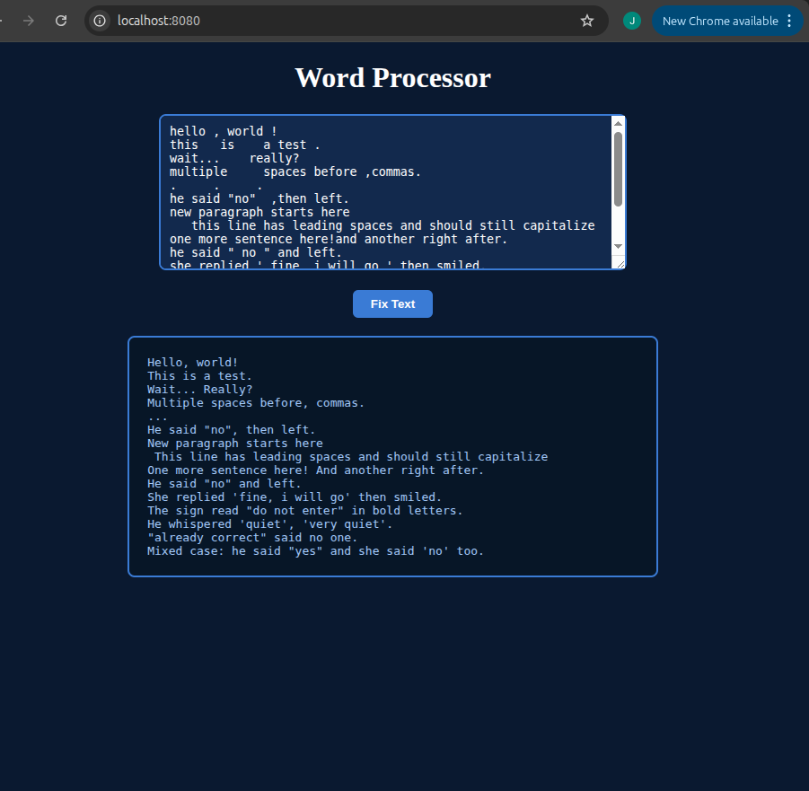

# word-processor-python-web

A web front-end for [word-processor-python]https://github.com/sundayjohnxavier47-png/word-processor-python.git — paste text into a browser, get the cleaned-up version back instantly. Built with Flask.

## Features

Same text-cleaning logic as the CLI version:
- Fixes punctuation spacing
- Fixes quote spacing
- Collapses multiple spaces
- Capitalizes the first letter of each sentence

## Setup

```bash
python3 -m venv venv
source venv/bin/activate
pip install -r requirements.txt
```

## Usage

```bash
python3 main.py
```

Then open `http://localhost:8080` in your browser, paste text into the box, and click "Fix Text."

## Project structure

- `main.py` — Flask app, routes, and form handling
- `puncta.py`, `caps.py`, `quotes.py` — same text-processing logic as the CLI version
- `templates/index.html` — the web page
- `requirements.txt` — project dependencies (Flask)

## Screenshot

**